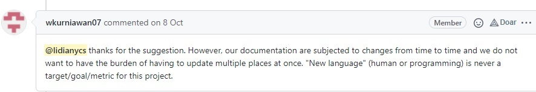

# **MATE28 - 2021.2**

  **Tópicos em Engenharia de Software IV**

LIDIANY CERQUEIRA SANTOS
PGCOMP - UFBA

https://github.com/mate28-ic-ufba/turma-20212

# Atividades

* Busca de projetos no Github
* Familiarização com o ambiente
* Tentativas de comunicação
* Mudança de projeto (TEAMMATES <-> Ethereum website)
   * tradução para PT-BR
   * participação do grupo no Discord

# Erros
Escolha inicial do projeto [TEAMMATES](https://github.com/TEAMMATES/teammates) pela temática

Projeto ativo, com 497 participantes

Porém, a comunidade não é receptiva 

# Acertos
Mudança para site do [Ethereum](https://github.com/ethereum/ethereum-org-website) 
  
Comunidade mais aberta

# Surpresas

Baixa receptividade no TEAMMATES

Rapidez na resolução das *issues* devido ao Hacktoberfest

Convite para equipe de tradução do Ethereum.org

# Resultados

1519 palavras traduzidas (https://crowdin.com/project/ethereum-org/) 

Esperando POAP [(Proof of Attendance Protocol)](https://ethereum.org/en/contributing/#poap) 

# Dificuldades

Hacktoberfest

Aprendizado: Markdown, Discord e avançar no Github

Interagir com a comunidade

Aulas na sexta a tarde (cansativo)
    
# Sugestões

Ambientação inicial  no Github

Mais atividades práticas como guia antes de interagir com as comunidades

# Thanks!

