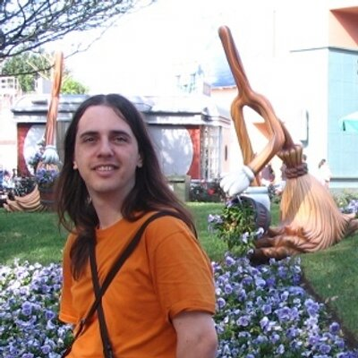

# Palestrantes

## Nelson Lago

Nelson Lago é diretor Técnico do Centro de Competência em Software Livre do IME-USP, onde trabalha pela divulgação do software livre. É graduado em Música pela USP, mestre em Ciência da Computação pelo IME/USP. Ministrou diversos cursos, apresentou palestras e participou de vários projetos envolvendo linux e software livre, abordando tanto aspectos técnicos quanto conceituais.

### Licenças de Software

Apresentação:
[Direitos de autor e licenças de software livre](licencas-soft-livre-2021.odp?raw=true)

